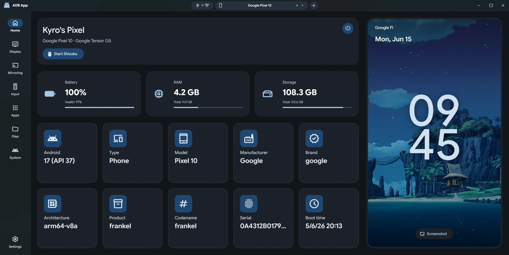

#  ADB App

**A modern, fast, and cross-platform desktop application to manage Android devices over ADB.**

<p align="center">
  <a href="https://github.com/kyro206/ADB-App/stargazers"></a>
  <a href="https://github.com/kyro206/ADB-App/commits/main"></a>
  <a href="https://github.com/kyro206/ADB-App/blob/main/LICENSE"></a>
  <a href="CHANGELOG.md"></a>

  <br />
  
  <a href="https://apps.microsoft.com/detail/9N4VV2153B05?referrer=appbadge&cid=github&mode=full" target="_blank"  rel="noopener noreferrer">
  	
  </a>
</p>

<div align="center">
  
</div>

## About

**ADB App** is a modern graphical interface built with [Tauri v2](https://v2.tauri.app/), [Rust](https://www.rust-lang.org/), and [Svelte](https://svelte.dev/), featuring a [Material Design](https://github.com/material-components/material-web) UI.

It is a direct replacement for [ADB Manager](https://github.com/agcarbajo/AdbManager), keeping the same features but taking things a step further. Thanks to an idea from [AYA](https://github.com/liriliri/aya), we've integrated app_process to run advanced internal commands, allowing you to query data and perform actions that go well beyond standard ADB capabilities.

Our goal is to provide a powerful, lightweight, and straightforward tool to manage your Android devices.

## Key Features

- **Dashboard:** Get a quick glance at your device's vital stats (Battery, RAM, Storage, Model, CPU, etc.), start Shizuku with a single click, and take instant screenshots.
- **Display:** Adjust screen resolution, pixel density (DPI), and screen timeout on the fly without needing a reboot.
- **Mirroring:** Stream your device's screen with full audio support, custom virtual displays, direct recording, and camera streaming. It's `scrcpy` with a graphical interface so you never have to touch the terminal.
- **Control:** Simulate keystrokes, control device navigation, change screen orientation, and even use your PC as an Android TV remote.
- **Apps Manager:** Install, uninstall, debloat, disable, and extract APKs. Reveal hidden permissions and double-click any app to launch it right from your PC.
- **File Explorer:** A fully-featured file manager to transfer content between your PC and your Android device. It supports drag-and-drop, permission changes, renaming, folder creation, audio and image previews, double click to open files and search.
- **System Settings:** Visually manage advanced options like installed keyboards (IME), secondary users, gesture navigation, and system-level permissions.
- **Wireless Connection:** Built-in wizard for Wi-Fi pairing (Android 11+), QR code scanning, and seamless switching from USB to wireless debugging.

*Navigate between tabs using `Ctrl+Tab`. Features full Dark Mode, system theme sync, and comes localized in both English and Spanish.*

## System Requirements

- **Windows:** Windows 10 or later.
- **macOS:** macOS 10.15 Catalina or later.
- **Android Device:** Must have **USB Debugging** enabled in the Developer Options.

## Installation

1. Download the version corresponding to your operating system from our [Releases](https://github.com/kyro206/ADB-App/releases) page.
2. Install and launch the app. Configure your tools in the Settings tab, and you're ready to go!

## Development

If you'd like to build the app yourself or contribute to the codebase:

### Prerequisites
- [Bun](https://bun.sh/)
- [Tauri's dependencies](https://v2.tauri.app/start/prerequisites/)

### Steps
1. Clone the repository:
   ```bash
   git clone https://github.com/kyro206/ADB-App.git
   cd ADB-App
   ```
2. Install frontend dependencies:
   ```bash
   bun install
   ```
3. Run the local development server:
   ```bash
   bun tauri dev
   ```
4. Build for production:
   ```bash
   bun tauri build
   ```

## License

This project is licensed under the [**GPL-3.0**](https://www.gnu.org/licenses/gpl-3.0.html) license. See the [LICENSE](LICENSE) file for details.

ADB App relies on several open-source projects to function:
- **ADB** Copyright © The Android Open Source Project. Licensed under the [Apache License, Version 2.0 (the "License")](/tools/LICENSE-APACHE2).
- **scrcpy** Copyright © Genymobile. Licensed under the [Apache License, Version 2.0 (the "License")](/tools/LICENSE-APACHE2).
- **Android Logo** - The icon of this application includes a modification based on a work created and shared by Google and used according to terms described in the [Creative Commons 3.0 Attribution License](https://creativecommons.org/licenses/by/3.0/).

## Contributing

Contributions are always welcome! We'd love to hear your feedback and any issues you encounter. Feel free to open a *Pull Request* if you'd like to implement a feature or fix a bug yourself.

---
<div align="center">
  This is my first app and repository, so I hope you find it useful and enjoy using it!<br>
  Made with ❤️ by <b>Kyro206</b>
</div>
